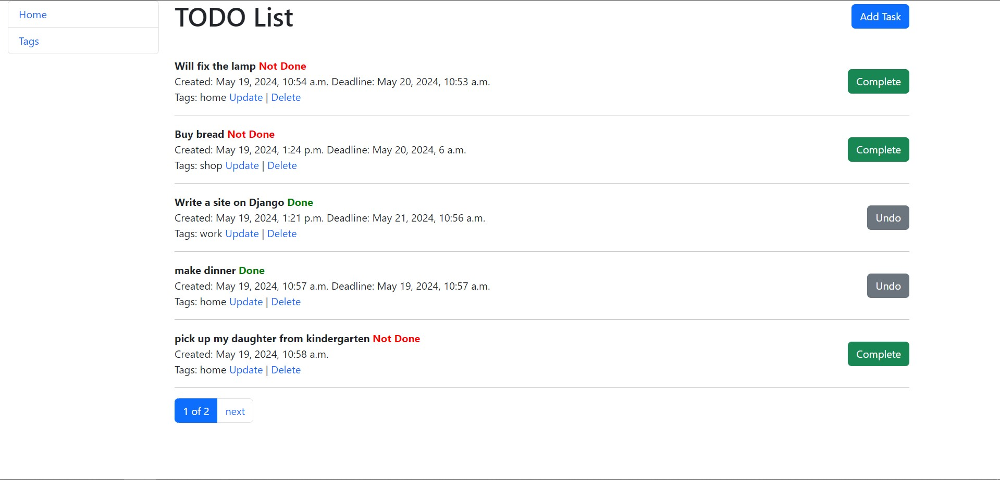

# TODO List

This project is a web application for managing to-do lists, built using the Django framework.

The primary objective of the application is to help users organize and manage their tasks. Users can create new tasks,
set deadlines, mark them as completed or incomplete, and assign tags for easier classification.

## Installation

1. Clone the repository to your local machine:

```bash
git clone https://github.com/saywin/press-portal.git
```

2. Create a virtual environment:

```bash
python -m venv venv
```

3. Activate the virtual environment:

On Windows:

```bash
venv\Scripts\activate
```

On Mac:

```bash
source venv/bin/activate
```

4. Install dependencies

```bash
pip install -r requirements.txt
```

5. Perform database migrations:

```bash
python manage.py migrate
```

6. Run the development server:

```bash
python manage.py runserver
```

## Technologies used

1. Django: A high-level Python web framework that encourages rapid development and clean, pragmatic design.
2. HTML/CSS: Standard markup and styling languages used for creating the application's user interface.
3. Bootstrap: A front-end framework for developing websites.
4. SQLite: A lightweight relational database management system used for storing application data during development and
   testing.

## Main page of the site

